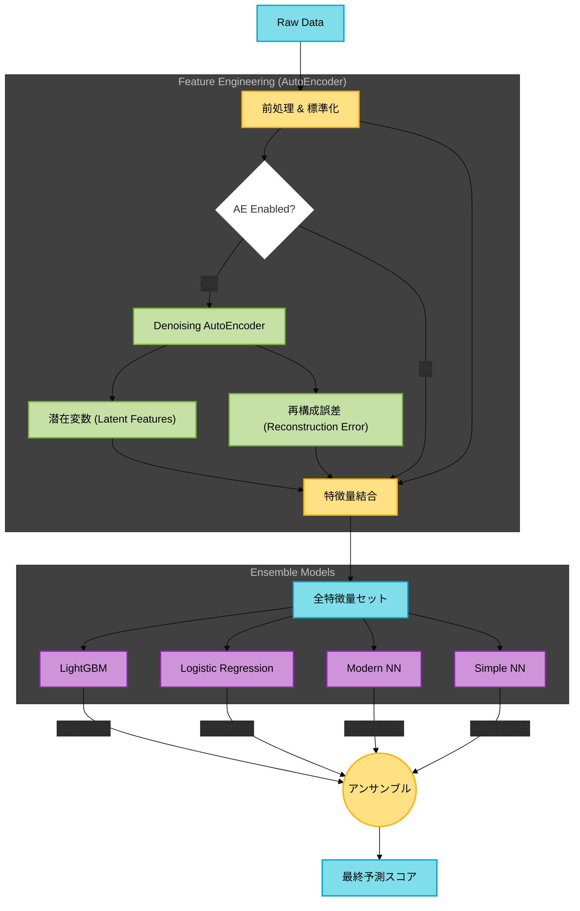

# Stock Analysis & NBA Recommendation Project

本リポジトリは、証券営業における人的資本の異質性と多目的制約を統合した **Next Best Action (NBA) リコメンドモデル** の構築、および株価データの分析を目的とした研究プロジェクトです。

今回はその一環として、**Denoising AutoEncoder (DAE)** による特徴抽出と、LightGBM・Neural Networkを組み合わせた**ハイブリッド・アンサンブル学習パイプライン**を実装しました。

## 1. 研究の背景と目的
- **研究テーマ**: 証券営業における購買確率予測とNBA提案モデルの開発
- **アプローチ**: 営業員の異質性（スキルや特性の違い）や多目的な制約条件を考慮した強化学習アルゴリズムの実装
- **目標**: 組織内でのAIエージェント活用による学習環境の整備と人材育成への貢献

## 2. システム構成 (Architecture)

本プロジェクトの分析パイプライン（`main.py`）のデータフローは以下の通りです。
Config設定により、AutoEncoderによる特徴抽出プロセスのON/OFFを動的に切り替え可能です。

## 3. 実装機能 (Key Features)
Denoising AutoEncoder (Feature Extraction)
ノイズを付与した入力から元のデータを復元するタスクを通じて、データの本質的な構造を学習します。

Latent Features: 情報を圧縮した潜在変数（4次元）。

Reconstruction Error: 復元誤差（MSE）。特異なパターンを持つデータ（異常値）を捉える指標として利用。

Hybrid Ensemble Strategy
特性の異なるモデルを組み合わせることで、予測の安定性と精度を向上させています。

LightGBM: テーブルデータに強い勾配ブースティング木。非線形な相互作用を捉える。

Modern NN: 3層構造（128-64-32）のニューラルネットワーク。Dropoutによる正則化を含む。

4. 主な技術スタック
開発環境
OS: Windows 11 / WSL2 (Ubuntu)

Hardware: Alienware M18 R2 (NVIDIA GeForce RTX 4090 Laptop GPU)

Conda Environment: jupyter_env

使用モデル・アルゴリズム
機械学習: LightGBM, XGBoost, TabNet

ディープラーニング: TensorFlow/Keras (AutoEncoder, NN), Transformers

強化学習: REINFORCE (Recycle Robot等での実装経験に基づく)

GPU最適化: RAPIDS (cuDF, cuML), Triton Inference Server

5. ディレクトリ構成

stock_analysis/
├── data/               # 証券データ・株価データ（※.gitignore により非公開）
│   └── output/         # 分析結果・学習済みモデルの出力先
├── src/                # ソースコード
│   ├── config.py       # 設定ファイル (AEのスイッチなど)
│   ├── runner.py       # 学習実行クラス
│   └── models/         # モデル定義
│       ├── autoencoder.py # ★ Denoising AE
│       ├── lgbm.py        # LightGBM Wrapper
│       └── nn.py          # Modern NN
├── main.py             # プロジェクトのメイン実行ファイル
├── requirements.txt    # 依存ライブラリ一覧
└── .gitignore          # 除外設定

6. セットアップと実行 (Usage)
環境構築
Conda環境を有効化した後、追加のライブラリをインストールします。

# 1. Conda環境の有効化
conda activate jupyter_env

# 2. 依存ライブラリのインストール
pip install -r requirements.txt

分析の実行

python main.py

実行結果（スコア、SHAP重要度プロット、Gain Chartなど）は data/output/YYYYMMDD_HHMMSS/ ディレクトリに保存されます。

設定の変更
src/config.py を編集することで、AutoEncoderの利用有無やハイパーパラメータを変更できます。

class Config:
    # AutoEncoderを使用するかどうかのフラグ
    USE_AUTOENCODER = True

7. 実績・活動
NVIDIA Student Ambassador (AI/DS Team): 2026年4月本格始動予定

NEC主催データ分析コンペ: 2025年夏季 優秀賞受賞

© 2026 Akifumi Goto (Shiga University / SMBC Nikko Securities Inc.) All Rights Reserved.
